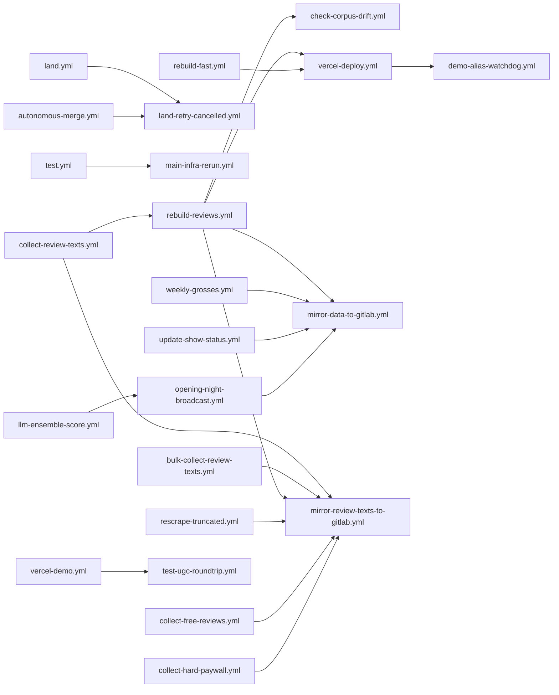

# Workflow dependency graph

<!-- GENERATED by scripts/generate-workflow-dependencies.js. Do not edit; run it and commit. CI: scripts/validate-workflow-dependencies.test.mjs -->
<!-- graph-fingerprint: 385a278d701f2b5b -->

Three repos share one automation fabric. Pushes in one fire workflows in another, so every
writer needs a known place in this graph.

| Repo | Role | Workflows | Reached from this repo via |
|---|---|---|---|
| `thomaspryor/Broadwayscore` (main) | code + all pipelines (271 workflows here) | this directory | n/a |
| `thomaspryor/broadway-scorecard-data` (private) | core data: shows.json, reviews.json, commercial.json | `submit-indexnow.yml`, `theatr-review-discovery.yml` (own repo) | `checkout-core-data` (read), `push-core-data` (write) |
| `thomaspryor/broadway-review-texts` (private) | review texts + aggregator archive | none checked in locally | `checkout-review-texts`/`checkout-aggregator-archive` (read), `push-review-texts`/`push-aggregator-archive` (write) |

The two private repos are written only by workflows in this repo (via the composite actions above), plus
the two data-repo workflows listed. A push into a private repo does not itself trigger main workflows;
main-side `workflow_run` / explicit dispatches below are what chain the pipeline.

## workflow_run chain

| Triggered workflow | Fires after |
|---|---|
| `check-corpus-drift.yml` | `rebuild-reviews.yml` |
| `demo-alias-watchdog.yml` | `vercel-deploy.yml` |
| `land-retry-cancelled.yml` | `land.yml`, `autonomous-merge.yml` |
| `main-infra-rerun.yml` | `test.yml` |
| `mirror-data-to-gitlab.yml` | `rebuild-reviews.yml`, `weekly-grosses.yml`, `update-show-status.yml`, `opening-night-broadcast.yml` |
| `mirror-review-texts-to-gitlab.yml` | `collect-review-texts.yml`, `bulk-collect-review-texts.yml`, `rebuild-reviews.yml`, `rescrape-truncated.yml`, `collect-free-reviews.yml`, `collect-hard-paywall.yml` |
| `opening-night-broadcast.yml` | `llm-ensemble-score.yml` |
| `rebuild-reviews.yml` | `collect-review-texts.yml` |
| `test-ugc-roundtrip.yml` | `vercel-demo.yml` |
| `vercel-deploy.yml` | `rebuild-reviews.yml`, `rebuild-fast.yml` |

## Explicit dispatches (workflow -> workflow)

| From | Dispatches |
|---|---|
| `adjudicate-review-queue.yml` | `rebuild-reviews.yml` |
| `audit-closing-dates.yml` | `vercel-deploy.yml` |
| `audit-we-closing-dates.yml` | `vercel-deploy.yml` |
| `auto-fix-feedback-bug.yml` | `vercel-deploy.yml` |
| `bulk-collect-review-texts.yml` | `extract-pull-quotes.yml`, `llm-ensemble-score.yml`, `rebuild-reviews.yml` |
| `check-show-freshness.yml` | `fetch-all-image-formats.yml` |
| `collect-outlet-reviews.yml` | `rebuild-reviews.yml` |
| `collect-review-texts.yml` | `llm-ensemble-score.yml`, `rebuild-reviews.yml` |
| `collect-we-ob-reviews.yml` | `rebuild-reviews.yml` |
| `commercial-friday.yml` | `vercel-deploy.yml` |
| `commercial-rss-poll.yml` | `vercel-deploy.yml` |
| `commercial-stale-closures.yml` | `vercel-deploy.yml` |
| `commercial-weekly.yml` | `vercel-deploy.yml` |
| `data-health-check.yml` | `investigate-alert.yml` |
| `discover-historical-shows.yml` | `backfill-cast.yml`, `fetch-all-image-formats.yml`, `gather-reviews.yml` |
| `discover-regional-serp-reviews.yml` | `rebuild-reviews.yml` |
| `discover-tour-stop-reviews.yml` | `rebuild-reviews.yml` |
| `drain-not-attempted.yml` | `rebuild-reviews.yml` |
| `fetch-todaytix-showtimes.yml` | `vercel-deploy.yml` |
| `fetch-tour-schedules.yml` | `vercel-deploy.yml` |
| `fix-platform-ticket-links.yml` | `vercel-deploy.yml` |
| `fix-todaytix-links.yml` | `vercel-deploy.yml` |
| `gather-reviews.yml` | `collect-review-texts.yml`, `llm-ensemble-score.yml`, `vercel-deploy.yml` |
| `historical-backfill.yml` | `gather-reviews.yml` |
| `llm-ensemble-score.yml` | `extract-pull-quotes.yml` |
| `newsletter-draft-refresh.yml` | `newsletter-draft.yml` |
| `newsletter-draft.yml` | `audit-aggregator-gap.yml` |
| `opening-night-broadcast.yml` | `gather-reviews.yml`, `investigate-alert.yml`, `vercel-deploy.yml` |
| `opening-night-express.yml` | `vercel-deploy.yml` |
| `opening-night-orchestrator.yml` | `opening-night-poller.yml` |
| `opening-night-poller.yml` | `fetch-guardian-reviews.yml`, `investigate-alert.yml`, `opening-night-broadcast.yml`, `rebuild-reviews.yml`, `update-critic-consensus.yml`, `vercel-deploy.yml` |
| `opening-night-reviews.yml` | `gather-reviews.yml`, `update-reddit-sentiment.yml` |
| `outlet-listing-poller.yml` | `rebuild-reviews.yml` |
| `overnight-collect.yml` | `rebuild-reviews.yml` |
| `process-commercial-tip.yml` | `vercel-deploy.yml` |
| `process-feedback.yml` | `auto-fix-feedback-bug.yml` |
| `rebuild-fast.yml` | `vercel-deploy.yml` |
| `rebuild-reviews.yml` | `llm-ensemble-score.yml`, `update-critic-consensus.yml`, `vercel-deploy.yml` |
| `recollect-for-scores.yml` | `rebuild-reviews.yml` |
| `recover-explicit-ratings.yml` | `rebuild-reviews.yml` |
| `recover-wayback-reviews.yml` | `rebuild-reviews.yml` |
| `recover-wsj-subscriber.yml` | `rebuild-reviews.yml` |
| `rediscover-urls.yml` | `collect-review-texts.yml` |
| `review-refresh.yml` | `gather-reviews.yml` |
| `rotate-theatr-token.yml` | `update-theatr.yml` |
| `scrape-alltime-grosses.yml` | `vercel-deploy.yml` |
| `scrape-dtli-show-score.yml` | `collect-review-texts.yml` |
| `scrape-new-aggregators.yml` | `collect-review-texts.yml`, `gather-reviews.yml`, `update-mezzanine.yml`, `update-reddit-sentiment.yml` |
| `scrape-stagedoor.yml` | `rebuild-reviews.yml` |
| `scrape-theatre-reviews.yml` | `rebuild-reviews.yml` |
| `scrape-thestage-roundups.yml` | `rebuild-reviews.yml` |
| `scrape-westendtheatre.yml` | `rebuild-reviews.yml` |
| `sweep-we-aggregators.yml` | `rebuild-reviews.yml` |
| `update-broadway-com.yml` | `vercel-deploy.yml` |
| `update-commercial.yml` | `vercel-deploy.yml` |
| `update-critic-consensus.yml` | `vercel-deploy.yml` |
| `update-lbo.yml` | `vercel-deploy.yml` |
| `update-lottery-rush.yml` | `vercel-deploy.yml` |
| `update-ltd.yml` | `vercel-deploy.yml` |
| `update-mezzanine.yml` | `vercel-deploy.yml` |
| `update-reddit-sentiment.yml` | `vercel-deploy.yml` |
| `update-seatplan.yml` | `vercel-deploy.yml` |
| `update-show-score.yml` | `vercel-deploy.yml` |
| `update-show-status.yml` | `backfill-cast.yml`, `check-opening-night-readiness.yml`, `collect-outlet-reviews.yml`, `collect-review-texts.yml`, `deep-research-commercial.yml`, `fetch-all-image-formats.yml`, `gather-reviews.yml`, `generate-related-shows.yml`, `opening-night-broadcast.yml`, `opening-night-express.yml`, `opening-night-poller.yml`, `social-post.yml`, `sweep-we-aggregators.yml`, `update-broadway-com.yml`, `update-lbo.yml`, `update-ltd.yml`, `update-mezzanine.yml`, `update-reddit-sentiment.yml`, `update-seatplan.yml`, `update-show-score.yml`, `update-theatr.yml`, `vercel-deploy.yml` |
| `update-theatr.yml` | `vercel-deploy.yml` |
| `vercel-deploy.yml` | `investigate-alert.yml`, `update-deploy-watermark.yml` |
| `we-newsletter-draft.yml` | `newsletter-draft.yml` |
| `weekly-grosses.yml` | `vercel-deploy.yml` |
| `weekly-stubhub-validate.yml` | `vercel-deploy.yml` |

Dispatches into other repos (iOS app, outside the three-repo data fabric):

| From | Repo | Workflow |
|---|---|---|
| `opening-night-broadcast.yml` | `thomaspryor/BroadwayScorecard-app` | `send-notifications.yml` |

## Cross-repo writers

Every workflow that pushes to a private repo. Each must carry a concurrency group (validator-enforced; exceptions listed in the test).

| Workflow | Class | Writes | Concurrency (group, cancel-in-progress) |
|---|---|---|---|
| `add-requested-show.yml` | other | broadway-scorecard-data | `add-requested-show-${{ inputs.dry_run == true && 'dry-run-' || '' }}${{ inputs.title }}` (false) |
| `adjudicate-review-queue.yml` | other | broadway-review-texts | `adjudicate-review-queue` (false) |
| `archive-aggregator-pages.yml` | scraping | broadway-review-texts | `archive-aggregator-pages` (false) |
| `audit-aggregator-gap.yml` | scraping | broadway-review-texts | `audit-aggregator-gap` (false) |
| `audit-closing-dates.yml` | other | broadway-scorecard-data | `shows-json-writer` (false) |
| `audit-reverse-discovery.yml` | other | broadway-scorecard-data | `audit-reverse-discovery` (false) |
| `audit-review-quality.yml` | other | broadway-review-texts | `audit-review-quality` (false) |
| `audit-touring-contamination.yml` | other | broadway-review-texts | `audit-touring-contamination-${{ github.event.inputs.market || 'broadway' }}` (false) |
| `audit-we-closing-dates.yml` | other | broadway-scorecard-data | `shows-json-writer` (false) |
| `auto-fix-feedback-bug.yml` | other | broadway-scorecard-data | `auto-fix-feedback-bug-${{ github.event.issue.number || inputs.issue_number }}` (false) |
| `backfill-aggregators.yml` | scraping | broadway-scorecard-data, broadway-review-texts | `backfill-aggregators-${{ github.run_id }}` (false) |
| `backfill-cast-web.yml` | scraping | broadway-scorecard-data | `backfill-cast-web` (false) |
| `backfill-cast.yml` | scraping | broadway-scorecard-data | `backfill-cast` (false) |
| `backfill-grosses.yml` | scraping | broadway-scorecard-data | `data-grosses-writers` (false) |
| `backfill-historical-metadata.yml` | scraping | broadway-scorecard-data | `shows-json-writer` (false) |
| `backfill-playwright-credits.yml` | scraping | broadway-scorecard-data | `backfill-playwright-credits` (false) |
| `backfill-review-dates.yml` | scraping | broadway-review-texts | `backfill-review-dates` (false) |
| `bulk-collect-review-texts.yml` | scraping | broadway-scorecard-data, broadway-review-texts | `bulk-collect-review-texts-${{ github.run_id }}` (false) |
| `bulk-reddit-sentiment.yml` | other | broadway-scorecard-data | `reddit-sentiment` (false) |
| `bulk-show-score.yml` | other | broadway-scorecard-data | `show-score` (false) |
| `check-show-freshness.yml` | other | broadway-scorecard-data | `shows-json-writer` (false) |
| `cleanup-multishow-flags.yml` | other | broadway-review-texts | `cleanup-multishow-flags` (false) |
| `clear-stale-duplicate-of.yml` | other | broadway-review-texts | `clear-stale-duplicate-of` (false) |
| `clear-stale-roundup-flags.yml` | other | broadway-review-texts | `clear-stale-roundup-flags` (false) |
| `clear-stale-suspected-misattribution-flags.yml` | other | broadway-review-texts | `clear-stale-suspected-misattribution` (false) |
| `clear-stale-wrong-production-flags.yml` | other | broadway-review-texts | `clear-stale-wrong-production-flags` (false) |
| `clear-stale-wrong-show-flags.yml` | other | broadway-review-texts | `clear-stale-wrong-show-flags` (false) |
| `clear-wrong-show-blockers.yml` | other | broadway-review-texts | `clear-wrong-show-blockers` (false) |
| `close-coverage-gaps.yml` | other | broadway-scorecard-data, broadway-review-texts | `close-coverage-gaps-${{ github.run_id }}` (false) |
| `collect-free-reviews.yml` | scraping | broadway-scorecard-data, broadway-review-texts | `collect-free-reviews-${{ github.run_id }}` (false) |
| `collect-hard-paywall.yml` | scraping | broadway-scorecard-data, broadway-review-texts | `collect-hard-paywall-${{ github.run_id }}` (false) |
| `collect-outlet-reviews.yml` | scraping | broadway-review-texts | `collect-outlet-reviews-${{ github.event.inputs.market || 'manual' }}` (false) |
| `collect-review-texts.yml` | scraping | broadway-review-texts | `collect-reviews-${{ github.event.inputs.show_filter && github.run_id || 'global' }}-${{ github.event.inputs.content_tier || 'all' }}-${{ github.event.inputs.domain_filter || 'any' }}-${{ github.event.inputs.market_filter || 'all-markets' }}` (false) |
| `collect-soft-paywall.yml` | scraping | broadway-scorecard-data, broadway-review-texts | `collect-soft-paywall-${{ github.run_id }}` (false) |
| `collect-we-ob-reviews.yml` | scraping | broadway-review-texts | `collect-we-ob-${{ inputs.market || 'scheduled' }}` (false) |
| `commercial-friday.yml` | other | broadway-scorecard-data | `commercial-data-write` (false) |
| `commercial-rss-poll.yml` | other | broadway-scorecard-data | `commercial-data-write` (false) |
| `commercial-stale-closures.yml` | other | broadway-scorecard-data | `commercial-data-write` (false) |
| `commercial-weekly.yml` | other | broadway-scorecard-data | `commercial-data-write` (false) |
| `dedupe-same-url-bylines.yml` | other | broadway-review-texts | `dedupe-same-url-bylines` (false) |
| `detect-ob-closings.yml` | other | broadway-scorecard-data | `shows-json-writer` (false) |
| `detect-revivals-ibdb.yml` | other | broadway-scorecard-data | `shows-json-writer` (false) |
| `detect-star-band-regressions.yml` | other | broadway-review-texts | `detect-star-band-regressions` (false) |
| `discover-historical-shows.yml` | other | broadway-scorecard-data | `discover-historical-${{ github.event.inputs.seasons }}` (false) |
| `discover-regional-serp-reviews.yml` | other | broadway-review-texts | `discover-regional-serp-reviews` (false) |
| `discover-tour-stop-reviews.yml` | other | broadway-review-texts | `discover-tour-stop-reviews` (false) |
| `drain-not-attempted.yml` | other | broadway-review-texts | `drain-not-attempted` (false) |
| `drain-self-contradictory-clears.yml` | other | broadway-review-texts | `drain-self-contradictory-clears` (false) |
| `enrich-ibdb-dates.yml` | scraping | broadway-scorecard-data | `shows-json-writer` (false) |
| `enrich-off-broadway-dates.yml` | scraping | broadway-scorecard-data | `shows-json-writer` (false) |
| `enrich-reviews.yml` | rebuild | broadway-scorecard-data, broadway-review-texts | `enrich-reviews-${{ github.run_id }}` (false) |
| `enrich-runtimes.yml` | scraping | broadway-scorecard-data | `enrich-runtimes` (false) |
| `enrich-west-end-dates.yml` | scraping | broadway-scorecard-data | `enrich-west-end-dates` (false) |
| `execute-approved-fix.yml` | other | broadway-scorecard-data, broadway-review-texts | `auto-fix-feedback-bug-${{ inputs.issue_number }}` (false) |
| `extract-pull-quotes.yml` | other | broadway-scorecard-data, broadway-review-texts | `extract-pull-quotes` (false) |
| `false-truncation-flag.yml` | other | broadway-review-texts | `false-truncation-flag` (false) |
| `fetch-aggregator-pages.yml` | scraping | broadway-review-texts | `fetch-aggregator-pages` (false) |
| `fetch-all-image-formats.yml` | scraping | broadway-scorecard-data | `fetch-images` (false, job-level) |
| `fetch-guardian-reviews.yml` | scraping | broadway-scorecard-data, broadway-review-texts | `fetch-guardian-reviews-${{ inputs.shows || 'scheduled' }}` (false) |
| `fetch-tour-schedules.yml` | scraping | broadway-scorecard-data | `fetch-tour-schedules` (true) |
| `fix-autoclear-ensemble-conflicts.yml` | other | broadway-review-texts | `fix-autoclear-ensemble-conflicts` (false) |
| `fix-circular-duplicate-pairs.yml` | other | broadway-review-texts | `fix-circular-duplicate-pairs` (false) |
| `fix-platform-ticket-links.yml` | other | broadway-scorecard-data | `fix-platform-ticket-links` (true) |
| `fix-todaytix-links.yml` | other | broadway-scorecard-data | `fix-todaytix-links` (true) |
| `gather-reviews.yml` | scraping | broadway-scorecard-data, broadway-review-texts | `gather-reviews-${{ github.run_id }}` (false); `rebuild-reviews` (false, job-level) |
| `llm-ensemble-score.yml` | scoring | broadway-scorecard-data, broadway-review-texts | `scoring-reviews${{ inputs.rescore_reason && format('-{0}', inputs.rescore_reason) || (inputs.show_id && format('-show-{0}', inputs.show_id)) || '' }}` (false) |
| `opening-night-broadcast.yml` | other | broadway-scorecard-data | `broadcast-send` (false) |
| `opening-night-express.yml` | other | broadway-scorecard-data, broadway-review-texts | `opening-night-express-${{ inputs.show_id }}` (false) |
| `opening-night-orchestrator.yml` | other | broadway-scorecard-data | **none** |
| `opening-night-poller.yml` | scraping | broadway-scorecard-data | `opening-night-poller-${{ inputs.show_id || inputs.market || 'auto-discovery' }}` (false) |
| `opening-night-reviews.yml` | other | broadway-review-texts | `opening-night-reviews` (false) |
| `outlet-listing-poller.yml` | scraping | broadway-review-texts | `outlet-listing-poller` (false) |
| `overnight-collect.yml` | other | broadway-review-texts | `overnight-collect` (false) |
| `poll-loureviews.yml` | other | broadway-review-texts | `poll-loureviews-${{ github.run_id }}` (false) |
| `process-commercial-tip.yml` | other | broadway-scorecard-data | `process-commercial-tip-${{ github.event.issue.number }}` (false) |
| `process-feedback.yml` | other | broadway-scorecard-data | `process-feedback` (false) |
| `process-review-submission.yml` | other | broadway-scorecard-data, broadway-review-texts | `process-review-submission-${{ github.event.issue.number || inputs.issue_number }}` (false) |
| `promote-owe-venue-candidates.yml` | other | broadway-scorecard-data | `shows-json-writer` (false) |
| `promote-we-aggregator.yml` | scraping | broadway-scorecard-data | `promote-we-aggregator` (false) |
| `rebuild-fast.yml` | rebuild | broadway-scorecard-data, broadway-review-texts | `rebuild-fast-${{ github.run_id }}` (false) |
| `rebuild-reviews.yml` | rebuild | broadway-scorecard-data, broadway-review-texts | `rebuild-reviews` (false) |
| `recollect-for-scores.yml` | scraping | broadway-review-texts | `recollect-scores` (false) |
| `reconcile-broadcast-state.yml` | other | broadway-scorecard-data | `reconcile-broadcast-state` (false) |
| `recover-explicit-ratings.yml` | other | broadway-review-texts | `recover-explicit-ratings` (false) |
| `recover-wayback-reviews.yml` | other | broadway-review-texts | `review-texts-backfill-write` (false) |
| `recover-wsj-subscriber.yml` | other | broadway-review-texts | `recover-wsj-subscriber` (false) |
| `recreate-broadcast-draft.yml` | other | broadway-scorecard-data | `recreate-broadcast-draft` (false) |
| `rediscover-urls.yml` | other | broadway-review-texts | `rediscover-urls` (false) |
| `refresh-show-score-opening-night.yml` | other | broadway-review-texts | `refresh-show-score-opening-night` (false) |
| `rescrape-truncated.yml` | scraping | broadway-scorecard-data, broadway-review-texts | `rescrape-truncated-${{ github.run_id }}` (false) |
| `retry-wrong-urls.yml` | other | broadway-review-texts | `retry-wrong-urls` (false) |
| `reverify-cv-promoted-nonreview.yml` | other | broadway-review-texts | `reverify-cv-promoted-nonreview` (false) |
| `review-refresh.yml` | other | broadway-scorecard-data, broadway-review-texts | `review-refresh` (false) |
| `scrape-alltime-grosses.yml` | scraping | broadway-scorecard-data | `data-grosses-writers` (false) |
| `scrape-bww-reviews.yml` | scraping | broadway-scorecard-data, broadway-review-texts | `scrape-bww-reviews` (false) |
| `scrape-dtli-show-score.yml` | scraping | broadway-scorecard-data, broadway-review-texts | `scrape-dtli-show-score` (false) |
| `scrape-new-aggregators.yml` | scraping | broadway-scorecard-data, broadway-review-texts | `scrape-new-aggregators` (false) |
| `scrape-nysr.yml` | scraping | broadway-review-texts | `scrape-nysr` (false) |
| `scrape-stagedoor.yml` | scraping | broadway-review-texts | `stagedoor-scrape` (false) |
| `scrape-theatre-reviews.yml` | scraping | broadway-review-texts | `theatre-reviews-scrape` (false) |
| `scrape-thestage-roundups.yml` | scraping | broadway-review-texts | `thestage-roundups-scrape` (false) |
| `scrape-waltz-costs.yml` | scraping | broadway-scorecard-data | `commercial-data-write` (false) |
| `scrape-westendtheatre.yml` | scraping | broadway-review-texts | `westendtheatre-scrape` (false) |
| `scrape-wp-blogs.yml` | scraping | broadway-review-texts | `scrape-wp-blogs` (false) |
| `send-follow-notifications.yml` | other | broadway-scorecard-data | `send-follow-notifications` (false) |
| `snapshot-audience-history.yml` | scoring | broadway-scorecard-data | `snapshot-audience-history` (false) |
| `star-band-backfill.yml` | other | broadway-review-texts | `star-band-backfill` (false) |
| `sweep-we-aggregators.yml` | scraping | broadway-review-texts | `sweep-we-aggregators` (false) |
| `sync-followers.yml` | other | broadway-scorecard-data | `sync-followers` (true) |
| `test.yml` | other | broadway-scorecard-data, broadway-review-texts | `${{ github.workflow }}-${{ github.ref }}-${{ github.event_name }}${{ github.ref == 'refs/heads/main' && format('-{0}', github.sha) || '' }}` (${{ github.ref != 'refs/heads/main' }}) |
| `update-broadway-com.yml` | other | broadway-scorecard-data | `broadway-com-${{ github.run_id }}` (false) |
| `update-commercial.yml` | other | broadway-scorecard-data | `commercial-data-write` (false) |
| `update-critic-consensus.yml` | other | broadway-scorecard-data | `update-critic-consensus` (false) |
| `update-lbo.yml` | other | broadway-scorecard-data | `lbo-${{ github.run_id }}` (false) |
| `update-lottery-rush.yml` | other | broadway-scorecard-data | `update-lottery-rush` (false) |
| `update-ltd.yml` | other | broadway-scorecard-data | `ltd` (false) |
| `update-mezzanine.yml` | other | broadway-scorecard-data | `mezzanine-${{ github.run_id }}` (false) |
| `update-precursor-awards.yml` | other | broadway-scorecard-data | `update-precursor-awards` (false) |
| `update-reddit-sentiment.yml` | other | broadway-scorecard-data | `reddit-sentiment-${{ github.run_id }}` (false) |
| `update-seatplan.yml` | other | broadway-scorecard-data | `seatplan-${{ github.run_id }}` (false) |
| `update-show-score.yml` | other | broadway-scorecard-data | `show-score-${{ github.run_id }}` (false) |
| `update-show-status.yml` | other | broadway-scorecard-data, broadway-review-texts | `shows-json-writer` (false) |
| `update-theatr.yml` | other | broadway-scorecard-data | `theatr` (false) |
| `update-tony-awards.yml` | other | broadway-scorecard-data | `tony-awards-update` (false) |
| `verify-existing-reviews.yml` | other | broadway-scorecard-data, broadway-review-texts | `verify-existing-reviews-${{ github.run_id }}` (false) |
| `weekly-grosses.yml` | other | broadway-scorecard-data | `data-grosses-writers` (false) |
| `weekly-integrity.yml` | other | broadway-review-texts | `weekly-integrity` (false) |
| `weekly-stubhub-validate.yml` | other | broadway-scorecard-data | `weekly-stubhub-validate` (false) |

## Concurrency classes and groups

Classes: **rebuild**, **scoring**, **scraping**, **deploy** (label derived from the workflow filename, see
`CLASS_RULES` in scripts/lib/workflow-dependency-graph.js). Serialization is enforced by concurrency *groups*.
A single shared group per class is deliberately NOT used: GitHub keeps one running and ONE pending run per group,
so a 40-member `scraping` group would cancel queued runs (the Beaches / Rocky Horror opening-night incident,
see rebuild-fast.yml). Workflows that must exclude each other share a *resource* group (`shows-json-writer`,
`rebuild-reviews`, `data-grosses-writers`, ...); everything else uses its own per-workflow group, so different
classes and unrelated jobs run in parallel.

Groups shared by 2+ workflows:

| Group | cancel-in-progress | Members |
|---|---|---|
| `auto-fix-feedback-bug-*` | false | `auto-fix-feedback-bug.yml`, `execute-approved-fix.yml` |
| `commercial-data-write` | false | `commercial-friday.yml`, `commercial-rss-poll.yml`, `commercial-stale-closures.yml`, `commercial-weekly.yml`, `deep-research-commercial.yml`, `scrape-waltz-costs.yml`, `update-commercial.yml` |
| `data-grosses-writers` | false | `backfill-grosses.yml`, `scrape-alltime-grosses.yml`, `weekly-grosses.yml` |
| `data-health-check` | false | `affiliate-link-integrity.yml`, `data-health-check.yml` |
| `landing` | false | `autonomous-merge.yml`, `land.yml` |
| `newsletter-draft` | false | `newsletter-draft-refresh.yml`, `newsletter-draft.yml` |
| `rebuild-reviews` | false | `gather-reviews.yml`, `rebuild-reviews.yml`, `scoring-audit.yml` |
| `review-texts-backfill-write` | false | `audit-cross-production.yml`, `recover-wayback-reviews.yml` |
| `shows-json-writer` | false | `audit-closing-dates.yml`, `audit-cross-production-weekly.yml`, `audit-we-closing-dates.yml`, `backfill-historical-metadata.yml`, `check-show-freshness.yml`, `detect-ob-closings.yml`, `detect-revivals-ibdb.yml`, `enrich-ibdb-dates.yml`, `enrich-off-broadway-dates.yml`, `promote-owe-venue-candidates.yml`, `update-show-status.yml` |
| `theatr` | false | `rotate-theatr-token.yml`, `update-theatr.yml` |

Workflows without any concurrency block, by class (read-only / alerting / test jobs mostly):

- **scoring** (4): `llm-evaluate.yml`, `scoring-experiment.yml`, `snapshot-audience-grades.yml`, `snapshot-award-scores.yml`
- **scraping** (2): `diag-fetch-timing.yml`, `scraper-cost-report.yml`
- **other** (31): `batch-commercial-research.yml`, `check-cookie-health.yml`, `check-cutoff-freshness.yml`, `check-linear-drain-health.yml`, `check-opening-night-readiness.yml`, `check-secrets-health.yml`, `check-show-metadata-consensus.yml`, `critique-plan-v2.yml`, `dependabot-auto-merge.yml`, `generate-related-shows.yml`, `generate-theater-tips.yml`, `get-ai-feedback.yml`, `get-gpt-plan-review.yml`, `investigate-alert.yml`, `lighthouse-post-deploy.yml`, `opening-night-orchestrator.yml`, `opening-night-stage-alert.yml`, `posthog-monday.yml`, `posthog-weekly-insights.yml`, `review-sprint-plan.yml`, `rotate-apple-secret.yml`, `rotate-gitlab-token.yml`, `scrapingdog-account-usage.yml`, `sentry-triage.yml`, `supabase-functions.yml`, `test-model-consistency.yml`, `test-paywalled-access.yml`, `test-review-validation.yml`, `verify-reviews.yml`, `we-newsletter-draft.yml`, `weekly-affiliate-report.yml`

## Secrets used by cross-repo writers

| Secret | Used by (cross-repo writers) |
|---|---|
| `ANTHROPIC_API_KEY` | 40 workflows |
| `APPROVAL_HMAC_SECRET` | 1 workflows: `auto-fix-feedback-bug.yml` |
| `BLOOMBERG_EMAIL` | 3 workflows: `bulk-collect-review-texts.yml`, `collect-hard-paywall.yml`, `collect-review-texts.yml` |
| `BLOOMBERG_PASSWORD` | 3 workflows: `bulk-collect-review-texts.yml`, `collect-hard-paywall.yml`, `collect-review-texts.yml` |
| `BRIGHTDATA_SERP_ZONE` | 1 workflows: `commercial-rss-poll.yml` |
| `BRIGHTDATA_TOKEN` | 67 workflows |
| `BRIGHTDATA_ZONE` | 62 workflows |
| `BROWSERBASE_API_KEY` | 15 workflows |
| `BROWSERBASE_PROJECT_ID` | 15 workflows |
| `COOKIES_BUNDLE_1` | 16 workflows |
| `COOKIES_BUNDLE_10` | 16 workflows |
| `COOKIES_BUNDLE_11` | 15 workflows |
| `COOKIES_BUNDLE_2` | 16 workflows |
| `COOKIES_BUNDLE_3` | 16 workflows |
| `COOKIES_BUNDLE_4` | 16 workflows |
| `COOKIES_BUNDLE_5` | 16 workflows |
| `COOKIES_BUNDLE_6` | 16 workflows |
| `COOKIES_BUNDLE_7` | 16 workflows |
| `COOKIES_BUNDLE_8` | 16 workflows |
| `COOKIES_BUNDLE_9` | 16 workflows |
| `DISCORD_WEBHOOK_ALERTS` | 103 workflows |
| `FORMSPREE_FOLLOW_API_KEY` | 3 workflows: `opening-night-broadcast.yml`, `send-follow-notifications.yml`, `sync-followers.yml` |
| `FORMSPREE_FOLLOW_FORM_ID` | 3 workflows: `opening-night-broadcast.yml`, `send-follow-notifications.yml`, `sync-followers.yml` |
| `FORMSPREE_SUBSCRIBER_API_KEY` | 3 workflows: `opening-night-broadcast.yml`, `send-follow-notifications.yml`, `sync-followers.yml` |
| `FORMSPREE_SUBSCRIBER_FORM_ID` | 3 workflows: `opening-night-broadcast.yml`, `send-follow-notifications.yml`, `sync-followers.yml` |
| `FORMSPREE_TOKEN` | 1 workflows: `process-feedback.yml` |
| `FORMSPREE_WESTEND_SUBSCRIBER_API_KEY` | 2 workflows: `opening-night-broadcast.yml`, `sync-followers.yml` |
| `FORMSPREE_WESTEND_SUBSCRIBER_FORM_ID` | 2 workflows: `opening-night-broadcast.yml`, `sync-followers.yml` |
| `FT_EMAIL` | 4 workflows |
| `FT_PASSWORD` | 4 workflows |
| `GEMINI_API_KEY` | 31 workflows |
| `GHA_BILLING_PAT` | 1 workflows: `opening-night-orchestrator.yml` |
| `GH_DISPATCH_TOKEN` | 3 workflows: `process-feedback.yml`, `process-review-submission.yml`, `rebuild-fast.yml` |
| `GITHUB_TOKEN` | 88 workflows |
| `GOOGLE_INDEXING_KEY` | 2 workflows: `opening-night-broadcast.yml`, `update-show-status.yml` |
| `GUARDIAN_API_KEY` | 4 workflows |
| `LINEAR_API_KEY` | 8 workflows |
| `MEZZANINE_APP_ID` | 2 workflows: `fetch-all-image-formats.yml`, `update-mezzanine.yml` |
| `MEZZANINE_SESSION_TOKEN` | 2 workflows: `fetch-all-image-formats.yml`, `update-mezzanine.yml` |
| `NEW_YORKER_EMAIL` | 4 workflows |
| `NEW_YORKER_PASSWORD` | 4 workflows |
| `NEXT_PUBLIC_SUPABASE_URL` | 1 workflows: `update-mezzanine.yml` |
| `NORTHJERSEY_EMAIL` | 3 workflows: `bulk-collect-review-texts.yml`, `collect-hard-paywall.yml`, `collect-review-texts.yml` |
| `NORTHJERSEY_PASSWORD` | 3 workflows: `bulk-collect-review-texts.yml`, `collect-hard-paywall.yml`, `collect-review-texts.yml` |
| `NOTION_API_KEY` | 3 workflows: `audit-aggregator-gap.yml`, `rebuild-reviews.yml`, `test.yml` |
| `NYDAILYNEWS_EMAIL` | 3 workflows: `bulk-collect-review-texts.yml`, `collect-hard-paywall.yml`, `collect-review-texts.yml` |
| `NYDAILYNEWS_PASSWORD` | 3 workflows: `bulk-collect-review-texts.yml`, `collect-hard-paywall.yml`, `collect-review-texts.yml` |
| `NYTIMES_PASSWORD` | 7 workflows |
| `NYT_COOKIES` | 1 workflows: `opening-night-express.yml` |
| `NYT_EMAIL` | 8 workflows |
| `NYT_PASSWORD` | 1 workflows: `process-review-submission.yml` |
| `OPENAI_API_KEY` | 30 workflows |
| `OPENROUTER_API_KEY` | 12 workflows |
| `OWNER_EMAIL` | 65 workflows |
| `REDDIT_CLIENT_ID` | 2 workflows: `bulk-reddit-sentiment.yml`, `update-reddit-sentiment.yml` |
| `REDDIT_CLIENT_SECRET` | 2 workflows: `bulk-reddit-sentiment.yml`, `update-reddit-sentiment.yml` |
| `RESEND_API_KEY` | 67 workflows |
| `RESEND_WE_AUDIENCE_ID` | 2 workflows: `opening-night-broadcast.yml`, `recreate-broadcast-draft.yml` |
| `REVIEW_TEXTS_TOKEN` | 128 workflows |
| `SCRAPINGBEE_API_KEY` | 68 workflows |
| `SCRAPINGDOG_API_KEY` | 74 workflows |
| `SUPABASE_SERVICE_ROLE_KEY` | 1 workflows: `update-mezzanine.yml` |
| `THEATR_REFRESH_TOKEN` | 1 workflows: `update-theatr.yml` |
| `TR_EMAIL` | 1 workflows: `review-refresh.yml` |
| `TR_PASSWORD` | 1 workflows: `review-refresh.yml` |
| `VERCEL_TOKEN` | 2 workflows: `opening-night-poller.yml`, `test.yml` |
| `VULTURE_COOKIES` | 1 workflows: `opening-night-express.yml` |
| `VULTURE_EMAIL` | 8 workflows |
| `VULTURE_PASSWORD` | 8 workflows |
| `WAPO_COOKIES` | 1 workflows: `opening-night-express.yml` |
| `WAPO_EMAIL` | 4 workflows |
| `WASHPOST_PASSWORD` | 4 workflows |
| `WSJ_COOKIES` | 15 workflows |
| `WSJ_EMAIL` | 4 workflows |
| `WSJ_PASSWORD` | 4 workflows |

Cross-repo auth is `CORE_DATA_TOKEN` / `REVIEW_TEXTS_TOKEN` / `REPO_TOKEN` passed to the composite actions. Full per-workflow secret audit: `node scripts/audit-workflow-secret-gaps.js`.

## Freeze (manual-intervention nights)

Run the **Automation Freeze** workflow (`automation-freeze.yml`, action=freeze, hours=8): disables non-critical cron and
`workflow_run` workflows, never `CRITICAL_CRONS` or the opening-night pipeline, and re-enables exactly what it disabled
(manually or automatically at expiry). Runbook: `memory/opening-night-freeze-runbook.md`.
